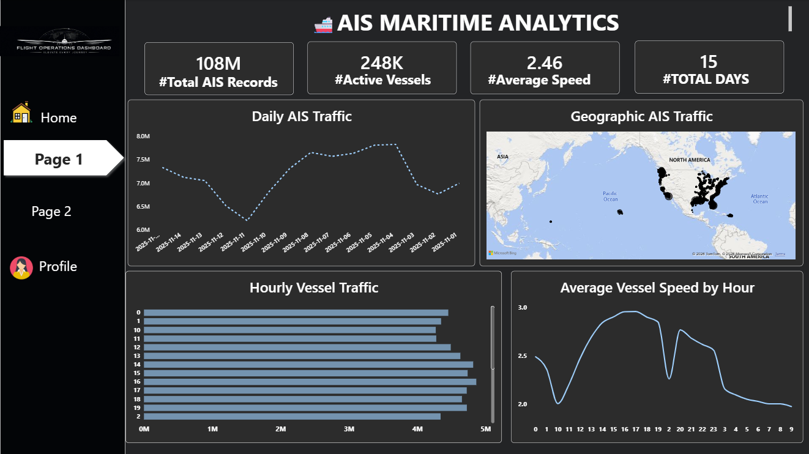
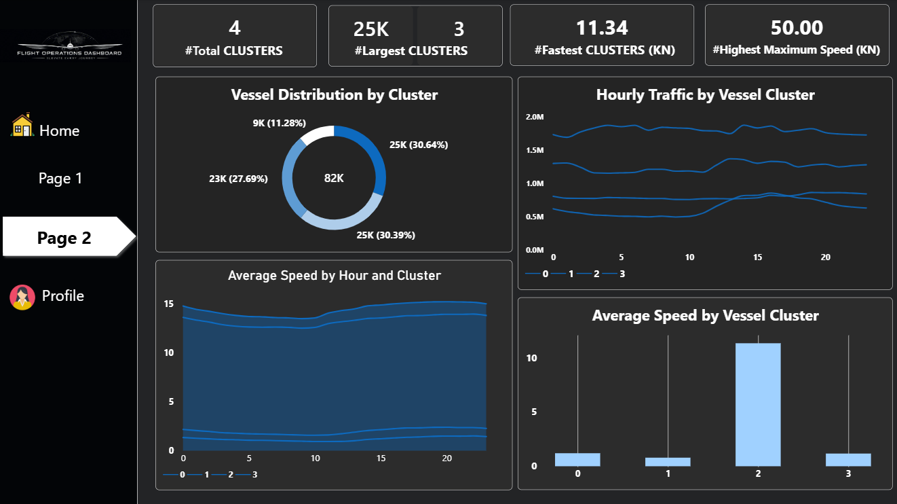
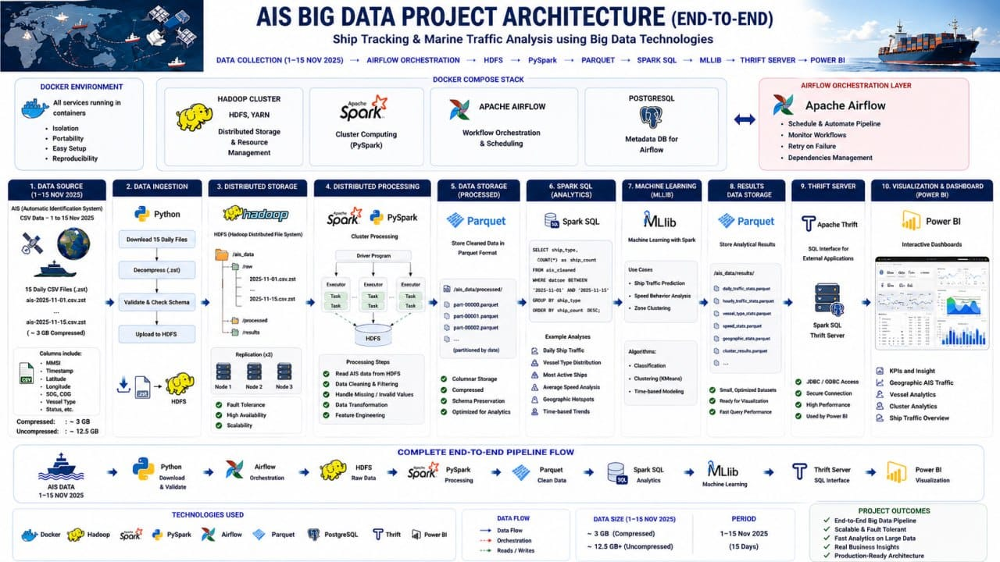

# 🚢 Marine AIS Big Data Analytics

A Big Data project for processing and analyzing large-scale **Automatic Identification System (AIS)** vessel data to understand maritime traffic, vessel activity, and geographic patterns.

🎥 Project Demo: "Watch the demo here" (https://drive.google.com/file/d/1ug_dgkYLpP24XfPaayJEzWvuPxuxX_PO/view?usp=sharing)

## 📊 Dashboard

### Overview



### Vessel & Traffic Analysis (ML)



The Power BI dashboard visualizes vessel traffic, geographic activity, traffic patterns, vessel speed, and vessel clustering.

## 🏗️ Architecture

```text
                 Apache Airflow
               Workflow Orchestration
                        │
                        ▼
AIS Data → Hadoop HDFS → Apache Spark → Spark Thrift Server → Power BI
                                      │
                                      ▼
                                 Spark MLlib
                              Vessel Clustering
```

## 🛠️ Tech Stack

* **Apache Airflow** — Workflow orchestration
* **Hadoop HDFS** — Distributed data storage
* **Apache Spark** — Data cleaning, processing, and analytics
* **Spark MLlib** — Vessel clustering
* **Spark Thrift Server** — SQL access to processed data
* **Power BI** — Data visualization
* **Docker** — Containerized environment
* **Python** — Spark applications

## 💾 Dataset

The project uses **2025 AIS vessel tracking data** provided by NOAA/NCEI.

📥 **[NOAA/NCEI AIS 2025 Dataset](https://noaaocm.blob.core.windows.net/ais/csv2/csv2025/index.html?utm_source)**

The raw dataset is not included in this repository due to its size.

## 📈 Analytics

Spark processes the AIS data and generates optimized datasets for Power BI, including:

* Daily traffic
* Hourly traffic
* Geographic traffic
* Vessel summaries
* Vessel clusters

Processed data is stored in **Parquet format on HDFS**.

## 🔄 Pipeline

```text
                 ┌─────────────┐
                 │   Airflow   │
                 │ Orchestration│
                 └──────┬──────┘
                        │
                        ▼
                 ┌─────────────┐
                 │     HDFS    │
                 └──────┬──────┘
                        │
                        ▼
                 ┌─────────────┐
                 │    Spark    │
                 └──────┬──────┘
                        │
                        ▼
              ┌──────────────────┐
              │ Spark Thrift     │
              │     Server       │
              └────────┬─────────┘
                       │
                       ▼
                  ┌─────────┐
                  │ Power BI│
                  └─────────┘
```

## 🎯 Project Goals

* Process large-scale AIS data using distributed technologies
* Analyze maritime traffic and vessel behavior
* Apply clustering to identify vessel patterns
* Automate the processing workflow with Airflow
* Deliver interactive insights through Power BI


